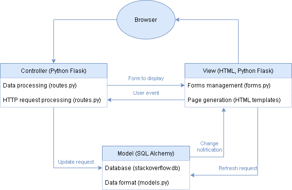

# SOEN-341

<head>
<h2>Description of the Project</h2> 
</head>
This project consists in building a question and answer website, similar to stack overflow and reddit, where users can ask questions, answer questions as well as upvote on which answer they think is best. We will divide this project into 4 building processes called sprints. Sprint 1 will consist in setting up the running environment. Our running environment, in other words, the language and techcnologies we will use are described later in this readme file, under language and technologies. In sprint 2, we will implement core features. These core feature will also be explained later in this readme file. In sprint 3 we will implement more features as well as receive feedback from our TA to improve our website. Lastly, sprint 4 we will fix bugs, thoroughly test our website and wrap up our final product.

<h2>Objective</h2>  
The objective of this project is to develop a website similar to the Q&A site StackOverflow.  We will build a website with three core features as well as a fourth feature that we will mention later on. Furthermore, another objective will be to understand the value of sprints and teamwork as well as to further our knowledge of software processes.

<h2>Core Features with User Stories</h2>
<h3>Asking and answering questions</h3>
As a forum user, I want to be able to post a question and receive helpful responses, as well as provide other users with helpful responses to their own questions. 
<h3>Voting on answers</h3>
As a web user, I want to be able to vote on answers to contribute to popular and prominent responses to forum questions. 
<h3>Accepting the best answer</h3>
As a academics user, I want to be able to see reliable responses to a question without having to look at all of them. 
<h3>Special feature: Having user profiles</h3>
As a forum user, I want to be able to identify myself and other users with credentials, allowing me and others to save our preferences and share our opinions. 

<h2>Architecture</h2>

<h2>Team Members (& Github Names)</h2>

• <b>Team Leader:</b> Samson Kaller (SamsonKaller) 
• Ramzi Boucetta (RamB98) 
• Jacob Lopez (jakelop) 
• Paul Westenberg (paulwestenberg) 
• Mouhamed Boubacar Diane (MomooDiane) 
• Mohammed Al-Taie (MohammedAltaiee) 
• Alexandre Vallières (SniffyMcTasty) 

<h2>Language and Technologies</h2>

To build the website, we will use a combination of HTML, CSS as well as JavaScript JSON. We will document, code as well as share said code on GitHub. Github will also be used to track when our team meets, for how long we meet and what we discuss during those meetings

<h2>Team log (meeting minutes)</h2>

- Sunday September 19th, Discord meeting:
   
  Created repo, explained the description of the project, the objective and technologies we will use.
  All members were familiarized with github as we all individually added our names using a commit.
   
- Thursday September 23rd, blended meeting:
   
  Decided to use current repo as github practice, and created new clean repo for 1st sprint.
  Went over the detailed Grading for Sprint 1 and compared with repo to verify if requirements are satisfied.
  Discussed special feature requirement (Options: Profile pic, "Trusted Tutor" badge).
  Finished user stories.
  Created issues and pull requests to satisfy Sprint1 requirements.
   
- Saturday September 28th, Discord meeting:
   
  Final review of sprint 1. Decided on the final feature and the technology used.
   
- Saturday, October 2nd:
   
  Discussed models being used for the website database: User, Question and Answer tables.
  Discussed user stories and planning poker for points, priority, risk, description.
   
- Wednesday, October 6th:
   
  Decided core feature to be completed first is the Asking & Answering Questions user story.
  Demo of python flask API for the website design.
   
- Monday, October 11th:
   
  Homepage implemented, demo of current site to team.
  Discussed adding continous integration platform TravisCI to repo for testing.
  Next features to be worked on: Register and Login User.
   
- Thursday, October 14th:
   
  CircleCI installed to repo, attempted tests but unsucessful.
  Decided to focus on website and leave CI for sprint 3.
  Discussed forms and html page content for register and login page.
  Next feature to implement: posting a question.
   
- Sunday, October 17th:
   
  Demo of registering/login and posting a question to website to team.
  Decided on creating forum page for browsing posted questions, then answer page when clicking the question.
  Next feature: answer pages.
   
- Wednesday, October 20th:
   
  Asking and answering questions feature completed.
  Demo of website to team.
  Reviewed requirements for Sprint 2 against current website status.
